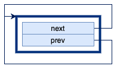
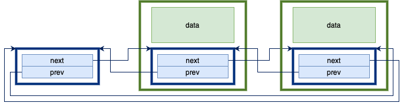
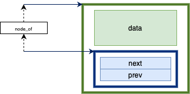
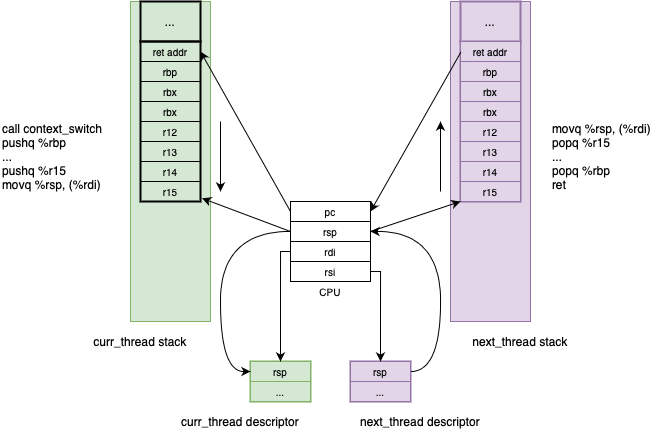
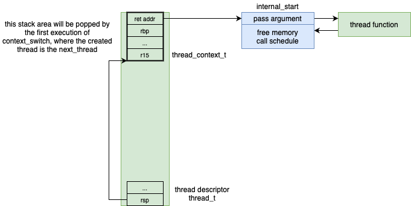

= uthreads - User Mode Cooperative Threads

== Introduction

_uthreads_ is a small native library, developed with the AMD64 (x86-64) and C languages, for illustrating how multi-threading can be achieved in user mode.
It is mainly intended as a pedagogical tool, providing a way for students to see an example of how some important concepts can be implemented, namely:

* What is a _context_ and what is _context switch_. 
* What is _scheduling_ and how it can be performed.
* What are the main thread states and how they are represented in the _uthread_ data structures.

== Development and execution environment

The _uthreads_ was designed for execution on a Linux environment using the AMD64 CPU architecture.
A way to have such an environment on non-Linux systes (e.g. Windows or macOS) is to use:

* Docker Desktop
* Visual Studio Code with the *Dev Containers* extension - https://marketplace.visualstudio.com/items?itemName=ms-vscode-remote.remote-containers

The *Dev Containers* extensions allows Visual Studio Code to run in _client-server_ mode, where:

* Most of the Visual Studio Code components will run inside container, namely file-system access.
* The Visual Studio Code user interface will still be running in the host system (e.g. Windows or macOS).

The configuration for this _client-server_ mode is defined inside the `.devcontainer` folder, namely:

* The `devcontainer.json` file.
* The `Dockerfile` file.

We will use the https://mcr.microsoft.com/en-us/product/devcontainers/cpp/about[mcr.microsoft.com/vscode/devcontainers/cpp:0-debian-11], which already includes the tools required for C and C++ based application development.

== `uthreads` components

=== Lists

The `list.h` and `list.c` files define functions to create and operate over double-linked _intrusive_ lists, with _sentinel_ nodes.
An _intrusive_ double-linked list includes the next and previous pointers in the data structure itself, so that each list element only requires a single contiguous block of memory.

The `list_entry_t` structure contains the next and previous pointers. 
The data items managed by the list need to contain a field of this type.
Most of the functions are self-documenting (e.g. `list_init` initializes a list).

.An empty list.
[#img-empty-list]

.List with two data items.
[#img-list-with-two-data-items]

The `node_of` is probably the least obvious part of this list. 
It returns the pointer to the data node, given the type of the data node and the pointer to the `list_entry_t` field inside the data node.

.`node_of` macro.
[#img-node-of]

=== Data structures

The `uthreads` library uses two main data structure types.
The first is `thread_t`, also called the _thread descriptor_, and contains information about a single thread, namely a pointer to the top of that thread's stack.

.Thread descriptor
[source, c]
----
// in uthread.c
struct uthread
{
  // needs to be the first field
  uint64_t rsp;
  start_routine_t start;
  uint64_t arg;
  list_entry_t list_entry;
};

// in uthread.h
typedef struct uthread uthread_t;
----

The second data structure is `uthread_context_t` and defines the layout of the thread's saved context.

.Thread context
[source, c]
----
// in uthread.c
typedef struct uthread_context
{
  uint64_t r15;
  uint64_t r14;
  uint64_t r13;
  uint64_t r12;
  uint64_t rbx;
  uint64_t rbp;
  void (*func_addr)();
} uthread_context_t;
----

=== Global variables

The `uthreads` library uses the following global variables:

* The `thread_running` points to the descriptor of the single _running_ thread. 
* The `queue_ready` contains the descriptors of all the _ready_ threads.
* The `thread_main` points to the descriptor of the main thread. The main thread represents the execution flow where the `uthreads` system was initialized.

=== Functions

=== Context switch [[sec_context_switch]]

A main component of the `uthreads` library is the `context_switch` function, responsible for switching the execution flow between two threads, represented by their thread descriptors.

.`context_switch` function
[source, c]
----
void context_switch(uthread_t *curr_thread, uthread_t *next_thread);
----

This function is written in assembly language and will be called from code written in the C language.
Due to this, we need to consider the link:https://refspecs.linuxfoundation.org/elf/x86_64-abi-0.99.pdf[C language calling convention for AMD64], namely:

* The way arguments are passed in, which will be the `rdi` and `rsi` for the first two arguments representable using 64 bits. That is, `curr_thread` will be passed in on `rdi` and `next_thread` will be passed in on `rsi`.

* The registers that must be preserved by the called function (i.e. the callee), which are `rbx`, `rbp`, `rsp`, and `r12` to `r15`.

Note that the program counter of the calling function is automatically saved on the stack by the execution of the `call context_switch` instruction.

The `context_switch` starts by pushing into the stack all registers that must be preserved by the callee function, except for `rsp`.
At the end of this, the stack for the current thread will look like this.

.Stack of the current thread, after `context_switch` saves the registers.
[#img-uthreads-curr-thread-stack]

The `rsp` register is then saved in the thread descriptor.
This will allows us to recover its value from the thread descriptor when switching back to the current thread.
If the `rsp` was only stored in the stack it would be impossible to recover it in the future, because we wouldn't know where the top of the stack for this thread would be.

Saving the `rsp` register into the current thread descriptor completes the saving of the current thread's context.
The next step is to restore the context for `next_thread`.
In order to do so, we need to first answer the following question: where is this context and what is its shape?

* If `next_thread` already ran in the past, then it execution was suspended due to a `context_switch` execution (where it was the running thread) and therefore its context is saved on its own stack, exactly as shown on xref:img-uthreads-curr-thread-stack[xrefstyle=short].

* If `next_thread` never ran in the past, then `context_switch` didn't yet preserved its context. However, we can make sure that thread creation initializes the thread stack with that exact same structure. This will allows us to write the restore part of `context_switch` without needing to know if `next_thread` already ran or not. Independently of that, its top of stack will have the same structure.

Using the above observations, the restore part of `context_switch` is the inverse of what was done in the first part:

* Move into the `rsp` register the value that was preserved in the thread descriptor.

* Pop all saved registers from stack.

* Return to the function that called `context_switch` when `curr_thread` was switched out of execution, or the thread's entry point if the thread never ran before.

.Context switch.
[#img-uthreads-context-switch]

The complete code for the `contex_switch` function is

.`context_switch` function
[source, c]
----
/* 
 * void context_switch(uthread_t *curr_thread, uthread_t *next_thread);
 *
 * Full context switch, saving the current thread context
 *  - %rdi has curr_thread
 *  - %rsi has next_thread
 */
context_switch:
    // suspend curr_thread ...
    // ... by saving the registers that aren't saved by the C compiler generated code 
	pushq %rbp
	pushq %rbx
	pushq %r12
	pushq %r13
	pushq %r14
	pushq %r15

    // ... %rsp is the only one that cannot be saved in the stack
    //     so we save it in the curr_thread descriptor
	movq %rsp, (%rdi)
	
    // resume next_thread ...
    // ... by loading the th1 stack from the th1 descriptor
	movq (%rsi), %rsp
	
    // ... and restoring the saved registers when next_thread was suspended
	popq %r15
	popq %r14
	popq %r13
	popq %r12
	popq %rbx
	popq %rbp
	
    // ... returning to the point on next_thread that called context_switch
	ret
----

==== `uthreads` initialization

The `ut_init` function initializes the `uthreads` system.
The main thing performed by this function is the `queue_ready` initialization, which will start empty.

==== Thread creation

The `ut_create` function creates a new thread and adds it to the `queue_ready`.
It receives a pointer to the function defining the thread execution and an argument to pass to it.

.`ut_create` function
[source, c]
----
typedef void (*thread_function_t)(uint64_t);
uthread_t *ut_create(thread_function_t thread_function, uint64_t arg)
----

This function starts by allocating space for two important things: the thread descriptor and the thread stack.
The current implementation uses a single block of memory to contain both things: the descriptor will be located at block start;
the stack will start from the block end, since the stack grows downward.

The `ut_create` function then initializes the top of the stack _as if_ a `context_switch` had run. 
As described in the <<sec-context-switch, `context_switch` section>>, this will be assumed when the `context_switch` runs.
For that, a `uthread_context` structure is mapped into the top end of the stack.

.Thread stack and descriptor after thread creation.
[#img-uthreads-thread-create]

The first `context_switch` that switchs execution into the created thread will use that initialized context.
Namely, the `ret` instruction executed at the end of the `context_switch` will jump the processor execution to the address in `ret_addr`.
At first sight this could be the thread's entry point address.
However, this `ret_addr` will instead point to `internal_start`, which is a wrapper on top of the thread function.
This wrapper will be responsible for:

* Calling the thread's entry point, passing in the argument defined on the `ut_create` call.
* When the thread finishes execution, freeing the allocated memory, and scheduling the execution of a different thread.

==== Scheduling

The `schedule` function is responsible to select the next thread to run and switch the execution into it.

* The next thread to run will be the one at the head of the _ready queue_, that is, the thread that is in the ready state longer.

* Call `context_switch`, from the current thread into that next thread; using and updating the `thread_running` global variable.

.`schedule` function
[source, c]
----
void schedule()
{
  uthread_t *next_thread = list_is_empty(&queue_ready)
                               ? thread_main
                               : node_of(list_remove_head(&queue_ready), uthread_t, list_entry);
  if (next_thread == thread_running)
  {
    // no context is needed because next_thread is already running
    return;
  }
  uthread_t *current = thread_running;
  thread_running = next_thread;
  context_switch(current, next_thread);
}
----
